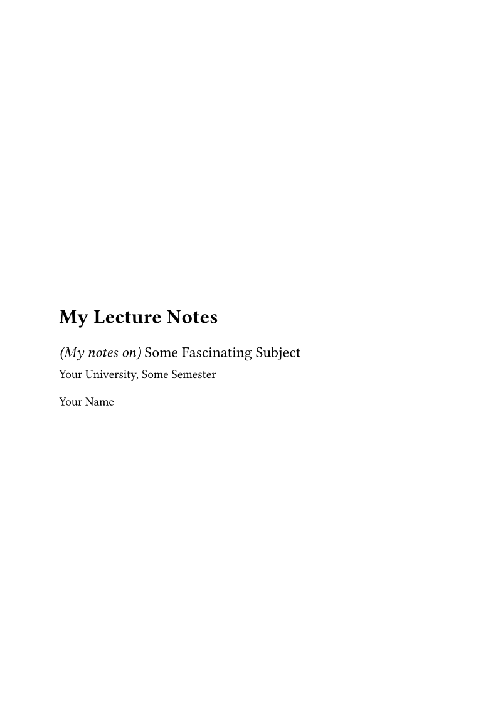

# scholia

A universal [Typst](https://typst.app) template for typeset **lecture notes and
study scripts**. It wraps the [`ilm`](https://typst.app/universe/package/ilm)
book template with a shared, colour-coded set of theorem-like environments and
sensible defaults for multi-chapter documents.

It was extracted from a personal set of university notes so the same look and
feel can be reused across courses.



## Features

- Book-style layout (cover, preface, abstract, ToC, running headers) via `ilm`.
- Coloured, left-ruled environments: `definition`, `theorem`, `lemma`,
  `proposition`, `corollary`, `remark`, `example`, and `proof` (with a trailing
  QED symbol), all sharing a single counter that follows the heading numbering.
- One-line document setup with pass-through to every `ilm` option.
- Configurable numbering depth, colours, and block styling.

## Quick start

```bash
typst init @preview/scholia
```

Or, using this repository directly as a local package, copy the `template/`
contents into a new project and import the package.

### Start a new notes project (recommended)

Use the bundled scaffolding script. It installs scholia into Typst's local
package namespace (so it works without being published), copies the template to
the target path, wires up the import, and creates a git repository:

```bash
./new-notes.sh ~/Notes/analysis-fs26 "Analysis I"
cd ~/Notes/analysis-fs26
typst watch main.typ
```

Pass `--force` to refresh the installed local package after you change scholia
itself. Run `./new-notes.sh --help` for details.

### Minimal document

```typ
#import "@preview/scholia:0.2.0": *

#show: scholia.with(
  title: [My Lecture Notes],
  subtitle: [_(My notes on)_ Some Fascinating Subject],
  authors: "Your Name",
  institution: [Your University, Some Semester],
  bibliography: bibliography("refs.bib"),
)

#let (definition, theorem, proof) = scholia-theorems()

= Getting Started

#definition(title: "Inner product")[
  A symmetric, bilinear, positive-definite map $⟨dot, dot⟩$.
]

#theorem(title: "Pythagoras")[
  If $⟨x, y⟩ = 0$ then $norm(x + y)^2 = norm(x)^2 + norm(y)^2$.
]

#proof[ Expand the norm. ]
```

### Multi-chapter documents

Because `include`d files do not inherit the caller's scope, put the environment
bindings in a shared file (`environments.typ`) and import it from every chapter.
See the [`template/`](template) directory for the full layout:

```
template/
  main.typ            # document setup + chapter includes
  environments.typ    # shared theorem bindings
  chapters/
    chapter1.typ      # imports ../environments.typ
  refs.bib
```

## API

### `scholia(..)` — the document show rule

| Argument            | Default            | Description                                                        |
| ------------------- | ------------------ | ------------------------------------------------------------------ |
| `title`             | `[Lecture Notes]`  | Document title.                                                    |
| `authors`           | `()`               | A string or array of author names.                                 |
| `subtitle`          | `none`             | Cover subtitle.                                                    |
| `institution`       | `none`             | Institution / course line on the cover.                            |
| `date`              | `datetime.today()` | Document date.                                                     |
| `abstract`          | `[]`               | Abstract content.                                                  |
| `preface`           | `none`             | Preface content.                                                   |
| `bibliography`      | `none`             | Pass `bibliography("refs.bib")` (built in your document so the path resolves there). |
| `heading-numbering` | `"1.1"`            | Heading numbering pattern.                                         |
| `cover-page`        | `auto`             | Override the generated cover with your own content, or `none`.     |
| `..ilm-args`        | —                  | Any extra named arguments are forwarded to `ilm` (e.g. `footer`, `appendix`, `figure-index: (enabled: true)`). |

### Structure above the chapter

A compendium that collects several sources needs levels above the chapter.
Pass `structural-levels: 3` to `scholia` and build the tree with
`scholia-area`, `scholia-work` and `scholia-division`:

```
1  area      Probability
2  work      A Second Course in Probability      <- the source
3  division  Summary                             <- or Exercises, Notes
4  chapter   Measure Theory and Laws of ...      <- the source's own chapter
5  section   Probability Spaces
```

Chapter files keep writing `=` for the chapter and `==` for its sections;
scholia offsets them into place. **Numbers stay local**: the chapter shows
`1`, a section `1.3`, a statement `Definition 1.3.1`, exactly as if the work
stood alone. The structural levels are counted but not displayed, so every
element still has a full, unique address underneath — and a reference that
points outside its own work is automatically qualified with the work's name.

Pass the same `structural-levels` to `scholia-theorems`, so block numbers are
sliced the same way.

```typ
#show: scholia.with(title: [My Compendium], structural-levels: 3)
#let (definition, ..) = scholia-theorems(structural-levels: 3)

#scholia-area([Probability])
#scholia-work([A Second Course in Probability], description: [Ross and Pekoz, 2023.])
#scholia-division([Summary])
#scholia-chapter([Measure Theory], description: [What this chapter covers.])
#include "notes/ross/01-measure-theory.typ"
```

One caveat worth stating: never hide the structural numbers with
`set heading(numbering: none)`. Unnumbered headings do not step the heading
counter, which silently zeroes every address. scholia hides them with a
numbering *function* that returns `none`, which keeps the counting intact.

### `scholia-chapter(..)` — a chapter opening

Gives a chapter file a proper header: a numbered chapter heading, an optional
subtitle, and an optional description ruled off from the body. Because the
heading is a real level-1 heading, it drives the table of contents and the
running header — so a chapter can be named after its source rather than after
its contents.

```typ
#scholia-chapter(
  [A Second Course in Probability],
  subtitle: [Measure theory and laws of large numbers],
  description: [My summary of the first chapter, with the book's own numbering
    kept on the right so anything here can be looked up in the original.],
)
```

| Argument            | Default           | Description                                  |
| ------------------- | ----------------- | -------------------------------------------- |
| `title` (positional)| —                 | The chapter heading.                          |
| `subtitle`          | `none`            | A line under the title.                       |
| `description`       | `none`            | A blurb, ruled off from the body text.        |
| `level`             | `1`               | Heading level.                                |
| `subtitle-size`     | `1.1em`           | Subtitle text size.                           |
| `description-size`  | `0.95em`          | Description text size.                        |
| `accent`            | `gray.darken(25%)`| Colour of subtitle, description, and rule.    |

### `scholia-theorems(..)` — the environments

Returns a dictionary of environment functions. Destructure the ones you need.

| Argument           | Default | Description                                                                 |
| ------------------ | ------- | --------------------------------------------------------------------------- |
| `inherited-levels` | `2`     | Heading levels the block number inherits. `2` → `Definition 2.3`; `1` → `Definition 2` (per chapter). Deeper heading nesting than this value is fine. |
| `colors`           | `(:)`   | Override any environment colour, e.g. `(theorem: purple)`.                   |
| `config`           | `(:)`   | Override styling keys for every environment (`border-width`, `inset`, `label-size`, `proof-label`, `qed-symbol`, `source-size`, `source-color`, `name-separator`, …). |
| `env-config`       | `(:)`   | Override styling keys for one environment only, e.g. `(example: (border-width: 0pt, inset: 0pt))`. Falls back to `config`, then to the defaults. |

```typ
#let (definition, theorem, example, proof) = scholia-theorems(
  inherited-levels: 1,
  colors: (theorem: purple.darken(20%)),
  config: (border-width: 2pt),
  // Examples flush with the body text, no coloured rule:
  env-config: (example: (border-width: 0pt, inset: 0pt)),
)
```

### Naming and attributing a block

Every environment takes two optional arguments:

| Argument | Description                                                                       |
| -------- | --------------------------------------------------------------------------------- |
| `title`  | The statement's own name, set in italics after the block number.                   |
| `source` | An attribution for borrowed material, set small and grey, flush with the right margin of the same line. |

```typ
#definition(
  title: "Probability measure",
  source: [Definition 1.3 in @ross2023secondcourse],
)[ ... ]
```

Either may be given alone. With `source` but no `title`, the separator before
the name is omitted, so the line reads `Definition 1.3.4` on the left and the
attribution on the right, with nothing dangling in between.

## Dependencies

- [`ilm`](https://typst.app/universe/package/ilm) `2.1.1`
- [`great-theorems`](https://typst.app/universe/package/great-theorems) `0.1.2`
- [`rich-counters`](https://typst.app/universe/package/rich-counters) `0.2.2`
  — `0.2.2` fixes a *"Cannot join integer with integer"* crash that occurred
  when a document nested headings deeper than the counter's `inherited_levels`.

## License

MIT © Davide Fiocchi
